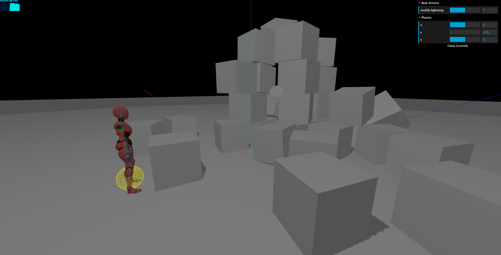

# Purpose
This repository contains three.js and cannon.js implementation of a full 3d world ruled by physics.

Further use of this project will be a game or an interactive 3d portfolio or whatever.

## Why
I wanted to reproduce earth physics as much as possible in order to reproduce myself in 3d and make me interact with different objects.
Later on I will add spells to my character and scenario to the scene.

### Physics engine result preview

